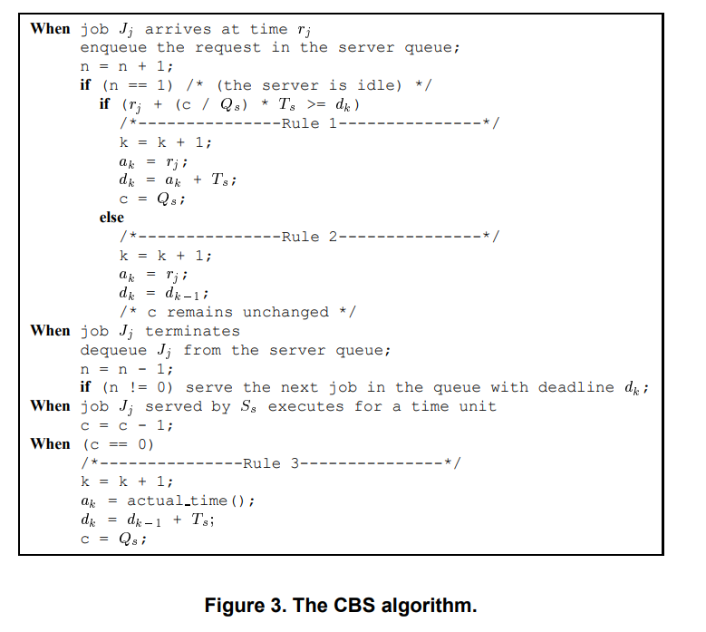

# CBS Design

## Main design choices

### 1. EDF is still the real scheduler

The kernel still schedules out of the EDF ready list.

CBS just changes what a server's deadline and remaining budget look like over time. EDF still decides what has the earliest deadline, and CBS keeps moving a server's deadline around when its reservation says it has to

### 2. CBS server is just implementeed as a normal EDF task with extra state

Instead of making a whole separate server object, I stored the CBS information in the TCB:

- `xCBSBudget`
- `xCBSRemainingBudget`
- `xCBSPeriod`
- `xCBSIsActive`

So a CBS server is basically just EDF task underneath plus reservation state on top

So the kernel can still look at the same task structure it already knows how to deal with.

`xTaskCreateCBS()` doesn't build a task from scratch in some special CBS-only way. It first creates a normal EDF task with:

- `C = Q`
- `T = T`
- `D = T`

Then it just adds the CBS reservation state on top. So the server can go through the same admission-control path as everything else.

## The CBS algorithm

Most of the implementation was just carrying out the rules of the actual CBS algorithm (from Buttazzo).

The version I was following is basically:

- when a job arrives to an idle server, check whether the current `(c, d)` state is still okay
- if it isn't, refresh the server to a new budget and a new deadline from "now"
- if it is, keep the old deadline and keep the current remaining budget
- while the server runs, burn budget
- when the budget hits `0`, postpone the deadline by one server period and refill the budget

So in the notation from the CBS algorithm:

- `Q` is the server budget
- `T` is the server period
- `c` is the current remaining budget
- `d` is the current absolute deadline

The main rules I actually use in the code are:

### Rule 1

If the server is idle and the current server state is too "dense" for how close the deadline is, refresh it:

- `c := Q`
- `d := now + T`

This is the part that comes from the usual CBS arrival test:

`q / (d - t) > Q / T`

or in the cross-multiplied form I used in the kernel:

`qT > Q(d - t)`

### Rule 2

If the server is idle **but** the current `(c, d)` pair is still okay, then don't throw that state away.

So the server keeps:

- its current deadline
- its current remaining budget

That part matters because CBS is not supposed to blindly reset itself every time it becomes ready again.

### Rule 3

When the server actually runs, its remaining budget burns down.

Then once:

- `c == 0`

the server gets postponed:

- `d := d + T`
- `c := Q`

(This part is visible on the gpio pins in the testing docs)

### What I simplified

My implementation doesn't keep a full aperiodic-job queue inside the kernel the way the textbook CBS presentation usually shows it.

So I am not really modelling: `n`, enqueue / dequeue logic, or explicit per-server request queues

Instead, I'm treating the CBS server itself as a task, and the kernel only tracks the reservation state that actually matters for scheduling (i.e. current budget, current deadline, server period, whether this task is acting as a CBS server)

So the CBS implementation in the kernel is really the scheduling part of the algorithm, not the fulling queueing implementation.

- Rule 1 / Rule 2 are in `prvCBSShouldReplenishServer()` and `prvCBSPrepareTaskForReadyList()`
- the budget burn happens in the tick path
- Rule 3 happens when `xCBSRemainingBudget` reaches `0`

So even though the code doesn't literally use the same variable names as the paper, that's the logic it is following.

## Stale server state

One small thing I had to be careful about was what I started calling stale server state; when the server's stored `(budget, deadline)` pair is no longer the pair that should really be used the next time EDF looks at it. (i.e. when the remaining budget already hit `0`, the stored deadline is already in the past, or the CBS test says the current reservation is too "heavy" for how close the deadline is)

That test is: `q / (d - t) > Q / T`

In the code I used the cross-multiplied version so I didn't have to divide and work with floats: `qT > Q(d - t)`

If that condition is true, the server gets refreshed before it goes back into the EDF ready list:

- `q := Q`
- `d := t + T`

That refresh step happens in `prvCBSPrepareTaskForReadyList()`.

I put the stale-state cleanup right before EDF reinserts the task into the ready list so by the time EDF sorts the server by deadline, the deadline is already the correct current one.

## Runtime budget handling

While a CBS server is actually running, its remaining budget burns down one tick at a time.

When the remaining budget reaches `0`, the kernel does two things: push the deadline out by one period, and refill the budget back to `Q`

So that is the normal CBS "you used up your reservation, now you get postponed" behaviour.

In my implementation that happens in the tick path, which means the budget accounting is tick-based rather than finer-grained runtime accounting. I point out how you can see this on the gpio pins in the CBS testing documentation.

## Equal-deadline tie break

I also ensured the same-deadline tie break behaviour outlined in the project readme. If a CBS server and a normal EDF task have the exact same absolute deadline, the kernel picks the CBS server.

If two CBS servers tie with each other, though, I left that alone and let ready-list order decide it.

## Feasibility / admission test used

CBS doesn't have a totally separate admission-control framework in this kernel. I reused the EDF admission logic that was already there.
The only change is that, with the CBS servers no, we have:

- server utilization = `Q / T`
- total task + server utilization has to stay admissible

So you can just add up periodic task utilizations and CBS server utilizations to determine schedulability. 
