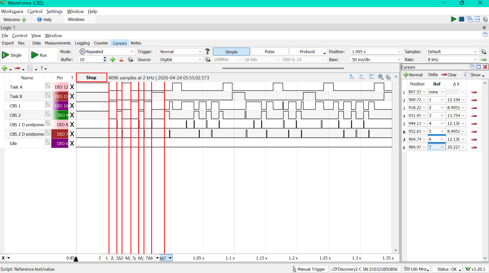
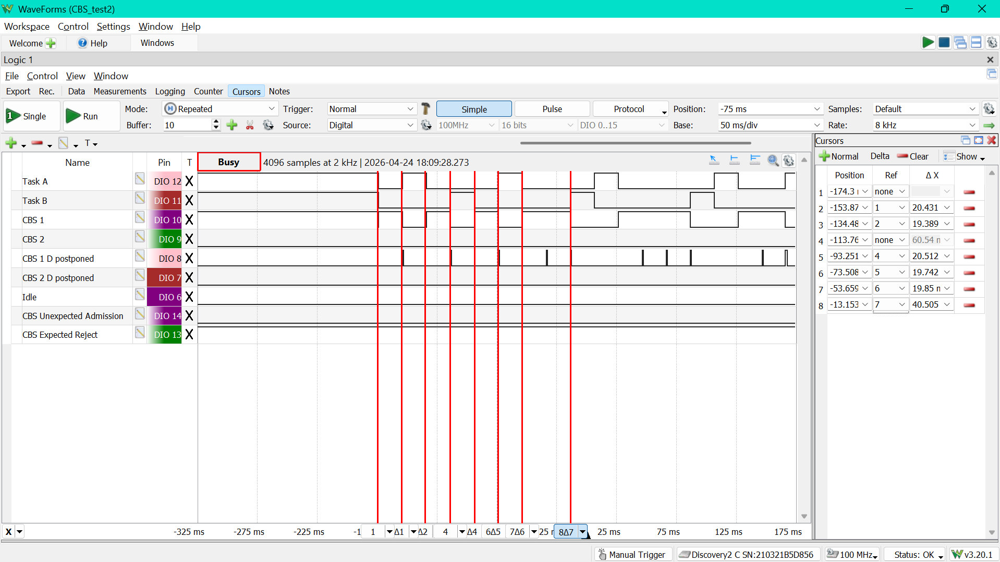
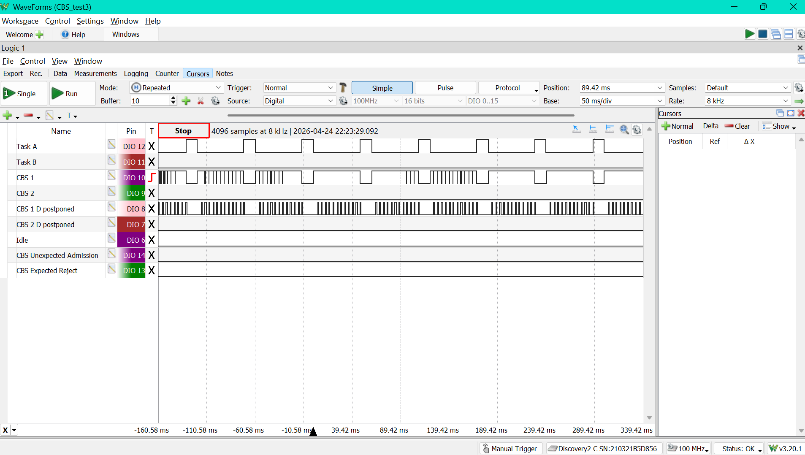
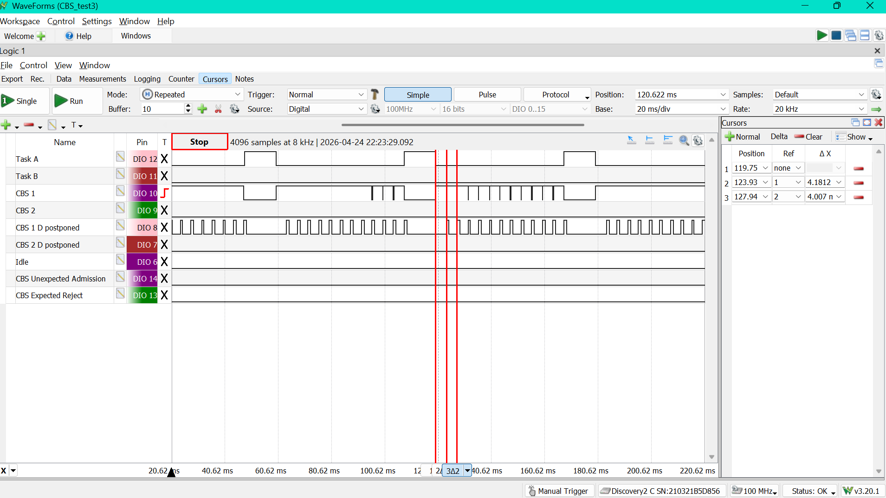
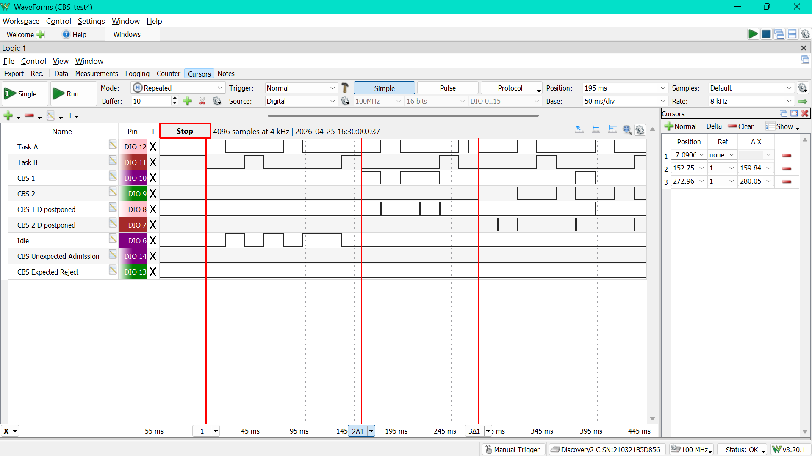
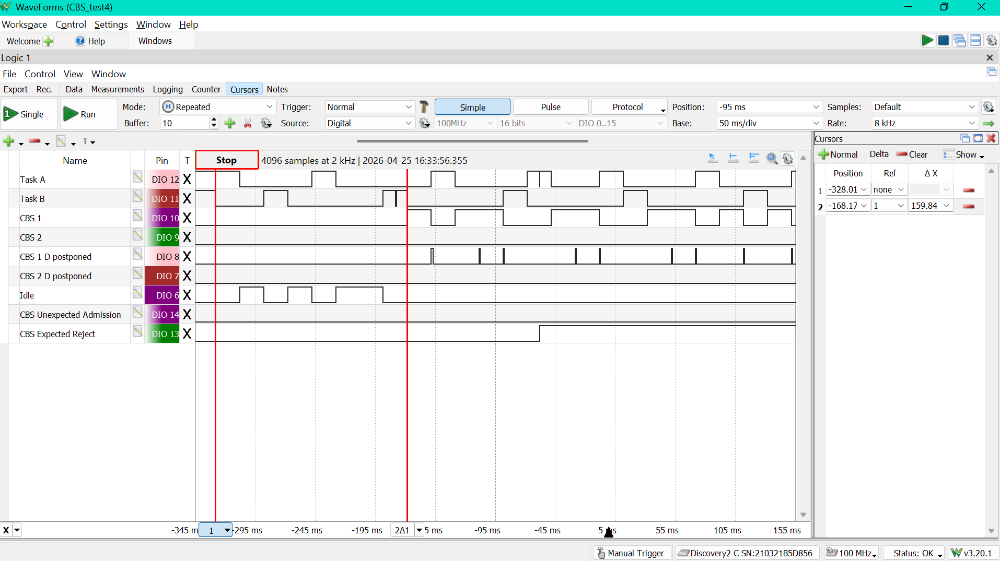

# CBS Testing
## Testing Overview
All tests were conducted in \Demo\ThirdParty\Community-Supported-Demos\CORTEX_M0_RP2040\Standard\main.c, in \Standard there is a file called `cbs_demo.c` which is called by main and controls which test case is run by setting a variable called `TESTCASE` (also defined in `cbs_demo.c`).

It covers the following test cases:
1. Basic CBS Functionality
2. CBS admission control (before scheduler starts)
3. CBS with small budget
4. Runtime admission control (after scheduler starts)

The testing was conducted using the logic analyzer of an Analog Discovery 2 and also by printing messages to the serial monitor. I had gpio pins tracking the periodic tasks, CBS servers, when CBS servers were delayed, and also flags for expected rejections of tasks or unexpected admissions (for admission control)

Also for almost all the CBS tests I was comparing schedules for, I would have to catch the gpio pulses right as the scheduler started to match them, since there are aperiodic elements.

Disclaimer: I would use cursors along the time base of the logic analyzer to measure timing (they're not perfectly accurate since you drag them by hand, but they still give a good view of the timing)


## Tests
All the timing numbers are in ms, unless stated otherwise.
### Test Case 1: 2 Period tasks with 2 backlogged CBS servers
Test 1 just tests the behaviour of two periodic EDF tasks working with two CBS servers. It will demonstrate how CBS servers only run when they have budget, and that priority tiebreaks break in favour of the CBS servers.

<b>Periodic Task Configuration</b>

| Task | C | T | D | offset
|:----:|:---:|:---:|:--:|:--:|
| τA   | 80 | 80 | 15 | 0|
| τB   | 120 | 120 | 20 | 20 |

<b>CBS Configuration</b>

| Server | Q | T | D | 
|:--:|:---:|:---:|:--:|
| CBS1| 12 | 60 | 3| 
| CBS2| 8 | 80 | 2 | 
C is remaining budget.

<b>Expected Scheduling</b>

| Time (ms) | What happens | why |
|:----:|:-----------:|:-------:|
| 0 - 12 | CBS1 runs | First deadlines are CBS1 = 60, A = 80, CBS2 = 80, B = 140, so CBS1 is first. It burns through the entirety of Q = 12 budget |
| 12 | CBS1 is postponed | Since CBS1's budget just hit 0, it's refreshed and its deadline is pushed from 60 to 120. The postpone pin pulses here. |
| 12 - 20 | CBS2 runs | Task A and CBS2 are tied at deadline 80, but <b> the kernel breaks that tie in favour of the CBS server </b>, so CBS2 goes next. It uses its whole Q = 8 budget. |
| 20 | CBS2 is postponed | Its budget is empty, so its deadline moves from 80 to 160. Postpone pin pulses |
| 20 - 35 | Task A runs | Task A now has earliest deadline left in the system, so it gets its full 15 ticks. |
| 35 - 47 | CBS1 runs again | After Task A blocks until its next period, CBS1 is back to being the earliest thing ready with deadline 120. It spends its refreshed 12 ticks |
| around 47 | Task B DOESN'T run | B is supposed to be next because its deadline 140 is now earliest, but then it applies its 20 tick startup offset so it can't run |
| 47 - 55 | CBS2 runs again | Since B is blocked, CBS2 has deadline 160 and beats CBS1, which has already been pushed back again |
| 55 - 67 | CBS1 runs again | Again, once CBS2 spends its budget, CBS1 becomes the earlier server |
| 67 - 87 | Periodic B runs for real | Task B's offset delay has expired by now, so this is its first actual 20 tick job. |
| 87 - 102 | Periodic A runs again | Task A's second job is ready and has the earliest deadline, so it preempts the backlogged servers |
| after that | Same pattern repeats | Task A and B still win when their deadlines come due, and the two CBS servers fill the gaps by burning budget, getting postponed, and coming back later. |

A little sidenote on the GPIOs: the CBS server pulses are split into smaller pieces; the demo's `chunk` behaviour. CBS1 does 3 ticks at a time and yields (goes to `taskYIELD()`), and CBS2 does 2 ticks at a time and yields, so sometimes on the logic analyzer, this budget shows up as a few short high pulses packed right beside each other.


<b>Actual Timing Diagram</b>

<br>

As you can see, all the way until the 7th cursor measuring the end of Task B running, the timing behaviour matches the theoretical table.


### Test Case 2: reject the second CBS server at admission time
This test demonstrates that CBS admission control is actually checking the admisssibility of the CBS sets, not just accepting every server I ask for. Task A, Task B, and CBS1 should all be admitted. `CBS2` is the one that should fail before the scheduler starts because its addition pushes the schedule past the utilization bound.

The reason is just the total reserved load:

- Task A uses `20 / 80 = 0.25`
- Task B uses `20 / 100 = 0.20`
- CBS1 uses `20 / 80 = 0.25`
- total so far = `0.70`

Adding CBS2 would add another `20 / 60 = 0.333...`, which pushes the total over `1.0`, so the scheduler should reject it.

<b>Periodic Task Configuration</b>

| Task | C | T | D | offset |
|:----:|:---:|:---:|:--:|:--:|
| Task A | 20 | 80 | 80 | 0 |
| Task B | 20 | 100 | 100 | 20 |

<b>CBS Configuration</b>

| Server | Q | T | chunk |
|:---:|:---:|:---:|:--:|
| CBS1 | 20 | 80 | 5 |
| CBS2 | 20 | 60 | 5 |

<b>What we should see</b>

- CBS2 should be rejected at task creation time
- `GPIO13` should go high and stay high, since that is the expected-reject pin
- `GPIO14` should stay low, because nothing unexpected happened

You should also see `Expected reject: CBS2` on the serial monitor before the scheduler starts.

<b>Expected Scheduling</b>

| Time (ms) | What happens | Why |
|:----:|:-----------:|:-------:|
| before scheduler starts | CBS2 is rejected | Admission control catches it during creation, so `GPIO13` goes high before any runtime scheduling happens, and CBS2 never runs |
| 0 - 20 | CBS1 runs | CBS1 and Task A both start with deadline 80, and the kernel breaks that tie in favour of the CBS server. |
| 20 | CBS1 is postponed | It just spent all 20 ticks of budget, so its deadline is pushed back from 80 to 160. |
| 20 - 40 | Task A runs | Task A now has the earliest deadline left in the system. |
| around 40 | Task B DOESN'T run | Task B gets picked next, but it immediately applies its 20 tick startup offset, so it can't actually run yet |
| 40 - 60 | CBS1 runs again | With Task B blocked and Task A waiting for its next period, CBS1 is the only one that can run |
| 60 | CBS1 is postponed again | Another full budget run, so another postpone pulse. |
| 60 - 80 | Task B runs for real | Task B's startup offset has expired by this point, so this is its first actual job. |
| 80 - 100 | Task A runs again | Task A's second job is released and has the earlier deadline. |
| 100 - 120 | CBS1 runs again | Again, when the periodic tasks are sleeping, the server fills the gap |
| 120 - 160 | Idle | Both periodic tasks are blocked until their next releases, and CBS1 has already burned through its current budget |

After that, the same three admitted tasks keep cycling

<b>Actual Timing Diagram</b>

<br>

<br>

### Test Case 3: make deadline postponements easy to see
This one shows the CBS behaviour on the GPIOs. There is only one periodic task and one CBS server, and the server has a tiny budget with `chunk = 1`, so it burns through its reservation all the time.

That makes the postpone pin really easy to spot.

<b>Periodic Task Configuration</b>

| Task | C | T | D | offset |
|:----:|:---:|:---:|:--:|:--:|
| Task A | 12 | 60 | 60 | 0 |

<b>CBS Configuration</b>

| Server | Q | T | chunk |
|:---:|:---:|:---:|:--:|
| CBS1 | 4 | 40 | 1 |

<b>What this test is checking</b>

- CBS1 should keep exhausting its budget very quickly
- every time that happens, its deadline should be postponed and the postpone pin should pulse
- the server task pin should look chopped into lots of tiny pieces, because `chunk = 1` means it yields every single tick
- Task A should still run whenever its release comes around


<b>Expected Scheduling</b>
CBS1 should keep repeating in 4-tick bursts in-between the periods of Task A (48s between the end of a Task A job and the start of the next one) as it runs out of budget and the budget is refreshed again and again.

<b>Actual Timing Diagram</b>

<br>

<b>Zoomed-in Version to show 4ms Ticks</b>

<br>

In the timing diagram, we indeed see these 4ms ticks while CBS1 is running for the 48s between the jobs of Task A. That being said, they don't always show up. I believe this is just a result of the logic analyzer not being quick enough to catch those pulses sometimes. 

### Test Case 4: create CBS servers after the scheduler has already started
This one is checking admission control while the scheduler is running instead of startup admission control. At the beginning, only the two periodic EDF tasks are created. Then a small launcher task waits a bit and tries to create CBS1 while the system is already running. Later, it does the same thing for CBS2.

With admission control enabled, CBS1 should be accepted and CBS2 should be rejected.
With admission control no enabled, both CBS1 and CB2 will be accepted.

The math is the same as  in testcase 2, just moved to runtime instead of startup:

- Task A uses `20 / 80 = 0.25`
- Task B uses `20 / 100 = 0.20`
- startup load is `0.45`
- CBS1 adds `20 / 80 = 0.25`, bringing the total to `0.70`, so it should be accepted
- CBS2 adds `20 / 60 = 0.333...`, which pushes the total over `1.0`, so it should be rejected

<b>Periodic Task Configuration</b>

| Task | C | T | D | offset |
|:----:|:---:|:---:|:--:|:--:|
| Task A | 20 | 80 | 80 | 0 |
| Task B | 20 | 100 | 100 | 20 |

<b>CBS Configuration</b>

| Server | Q | T | chunk |
|:---:|:---:|:---:|:--:|
| CBS1 | 20 | 80 | 5 |
| CBS2 | 20 | 60 | 5 |

<b>Runtime Create Timing</b>

| Event | Delay |
|:---:|:---:|
| Try to create CBS1 | 150 ms after scheduler start |
| Try to create CBS2 | 120 ms after the CBS1 attempt |

<b>What this test is checking</b>

- before any runtime create happens, only Task A and Task B wil run
- around `150 ms`, the serial monitor should print `Runtime create attempt: CBS1`
- after that, CBS1 should start showing up on its task pin if it was accepted
- around `270 ms`, the serial monitor should print `Runtime create attempt: CBS2`
- with admission control enabled, CBS2 should be rejected at that point and `GPIO13` should go high. With it disabled, CBS2 will start showing up, and `GPIO13` won't go high.
- `GPIO14` should stay low, because nothing unexpected happened


<b>Actual Timing Diagram (no admission control)</b>

<br>

In this diagram without admission control, you can see that when CBS1 is released at t = 150ms, there's a drop in Task B running, but because the CBS servers are backlogged, Task B resumes running. Then, 10ms later, CBS1 actually starts running.
Likewise, at t = 270 ms, there's a drop in Task A when CBS2 is released, but CBS2 has to wait 10ms for Task B to finish before it can actually start running.

<b>Actual Timing Diagram (with admission control)</b>

<br>
In this diagram without admission control, you can see that when CBS1 is released at t = 150ms, there's the same drop in Task B running, but because the CBS servers are backlogged, Task B resumes running. Then, 10ms later, CBS1 actually starts running.
At t = 270ms, there's a drop in Task A when CBS2 is released, but admission control deems that it's unschedulable, so it never actually runs. At the same time, GPIO13 (CBS Expected Reject) goes high, marking the rejection of CBS2.

Everything is working as expected.


<b>Serial Monitor Message</b>
```
---- Opened the serial port COM7 ----
CBS TESTCASE 4: Runtime Admission Control
Pins: A=12 B=11 CBS1=10 CBS2=9 CBS1Postpone=8 CBS2Postpone=7 Idle=6 ExpectedReject=13 UnexpectedAdmission=14
Failed Tasks:
Runtime create attempt: CBS1
Runtime create attempt: CBS2
```