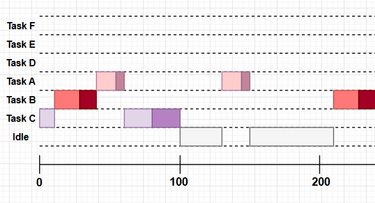
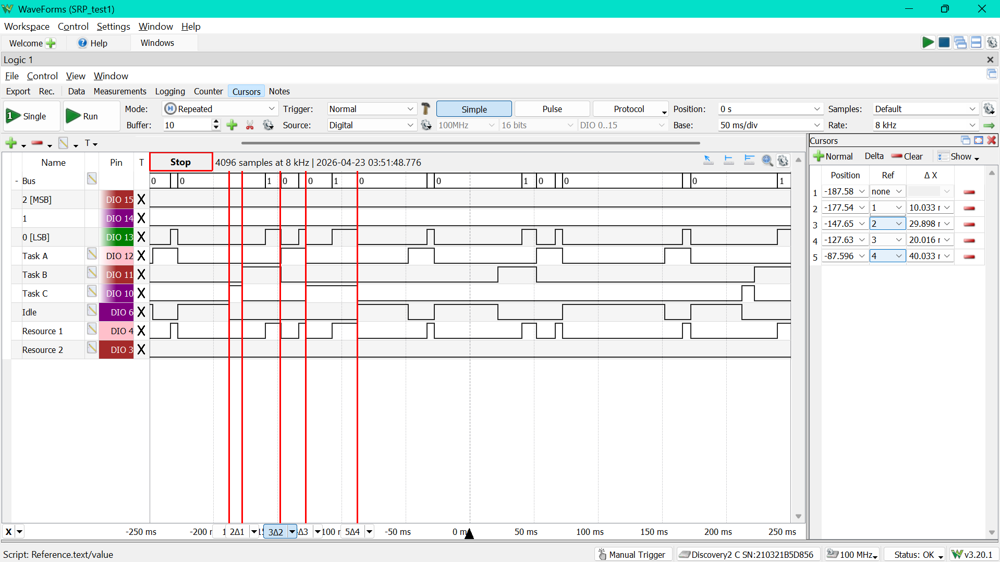
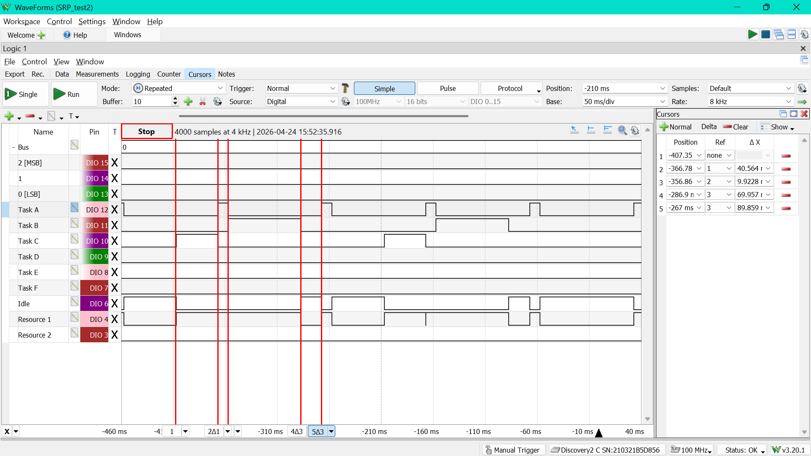
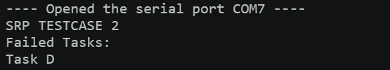
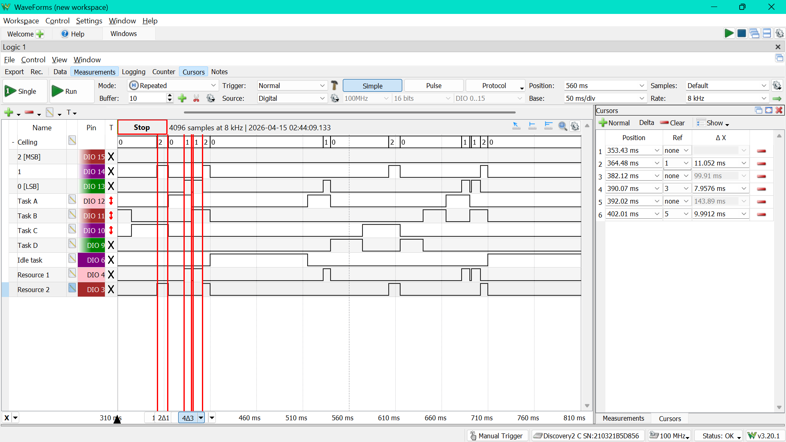
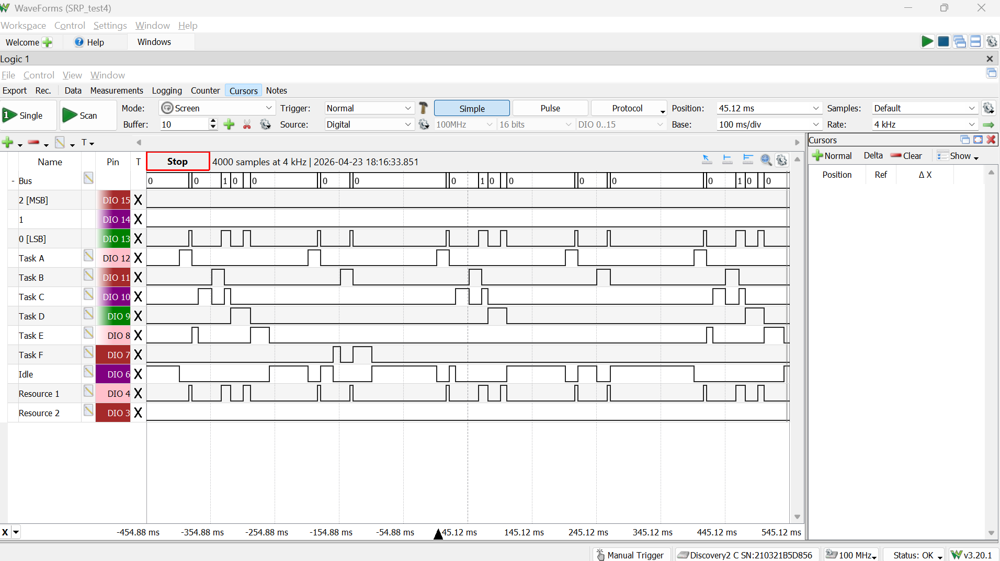
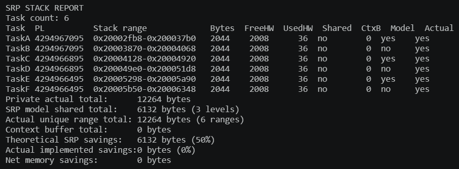
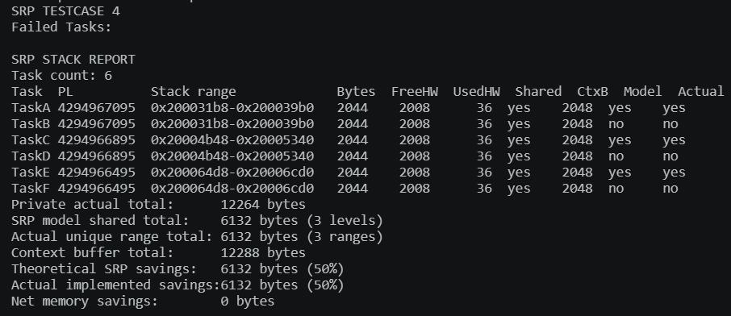
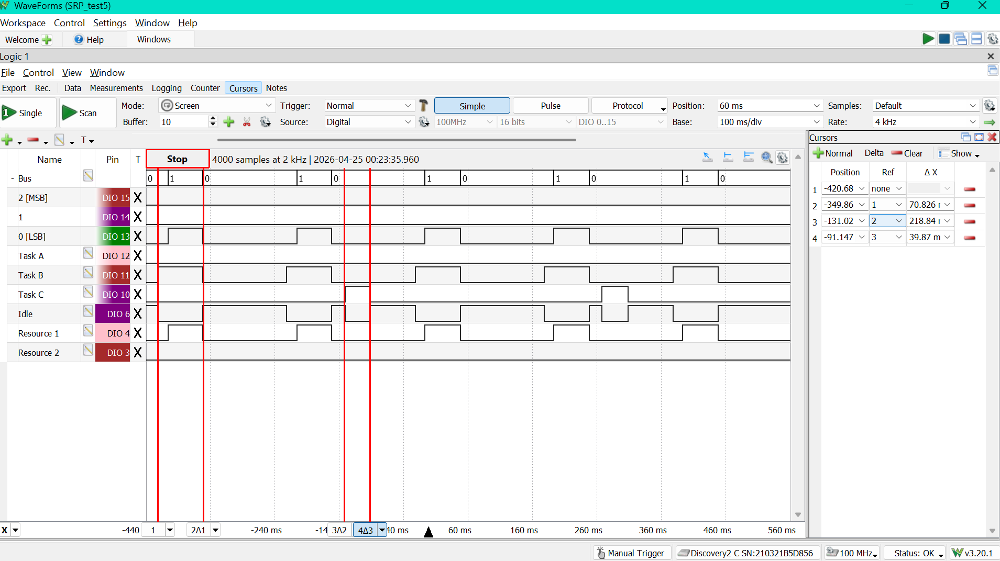

# SRP Testing

## Testing Procedure
All tests were conducted in \Demo\ThirdParty\Community-Supported-Demos\CORTEX_M0_RP2040\Standard\main.c, in \Standard there is a file called srp_demo.c which is called by main and controls which test case is run by setting a variable called TESTCASE (also defined in srp_demo.c).

It covers the following test cases which will also be shown here:
1. Basic Implicit Deadline w/ 1 Shared Resource
2. Admission Control w/ SRP blocking time
3. 2 Shared Resources
4. Stack-sharing
5. Constrained Deadline Admission Control
6. 100 Task testcase (stack-sharing gains)

The testing was conducted using the logic analyzer of an Analog Discovery 2 and also by printing messages to the serial monitor. I would use the logic analyzer to keep track of gpio pins for tasks running, as well as resource usage.

For example, I used three GPIO pins to make a binary bus that could track the system ceiling up to 7 resources being used (but admittedly, I never went past 2 resources because I did not want to schedule that by hand)

Disclaimer: I would use cursors along the time base of the logic analyzer to measure timing (they're not perfectly accurate since you drag them by hand, but they still give a good view of the timing)


## Testing
Also the tasks are designed so the critical section for each job is always placed at the end (so the jobs always first run their non-critical section, then use the shared resource for the last bit)
All the timing numbers are in ms, unless stated otherwise.

### Test Case 1: Implicit Deadline w/ 1 Shared Resource

<b>Task Configuration</b>

| Task | C | T | D |
|:----:|:---:|:---:|:--:|
| τA | 20 | 100 | 100 |
| τB | 30 | 200 | 200 |
| τC | 50 | 400 | 400 |


This test just checks if the SRP implementation is properly applying the locking function and ceiling level to prevent another "higher-priority" task from preempting a lower-priority task while it is using a shared resource.

<br>

<b>Theoretical Timing Diagram (up to 240 ms)</b>

<br>

<b>Expected Scheduling</b>

| Time (ms) | What happens | Why |
|:----:|:-----------:|:-------:|
| 0 - 10 | Task C runs | C is the only task released at time 0. A and B are still waiting on their startup offsets. |
| 10 - 28 | Task B runs | B is released at 10 ms and has an earlier deadline than C, so EDF switches to B. |
| 28 - 40 | Task B holds resource 1 | B has reached its critical section. The system ceiling rises here, so when A is released at 30 ms it still cannot start |
| 40 - 60 | Task A runs | Once B finishes and drops the resource, A has the earliest deadline in the ready set. |
| 60 - 100 | Task C finishes its first job | A is done, so C comes back. It finishes the rest of its non-critical work and then spends its last 20 ms in resource 1. |
| 100 - 130 | Idle | The first round of jobs is done and nothing else has been released yet. |
| 130 - 150 | Task A runs again | A's next period arrives before B or C release another job. |
| 150 - 210 | Idle | After A finishes, the system waits for B's next release. |
| 210 - 240 | Task B runs again | B's second job starts at 210 ms. A is released at 230 ms, but B is already in its shared section by then, so A has to wait. |
| 240 - 260 | Task A runs | As soon as B lets go of resource 1, A becomes the earliest ready task again. |
| after that | Same pattern repeats | A keeps getting the earlier deadline, but SRP still stops it from cutting into B or C while they are inside resource 1. |

<b>Actual Timing Diagram</b>


Matches the theoretical diagram and the expected schedule!
The resource is also being used when expected
<br>

### Test Case 2: Admission Control
Set `config_USE_ADMISSION_CONTROL = 1`

<b>Task Configuration</b>

| Task | C   |   T | D  | U  |
|:----:|:---:|:---:|:--:|:--:|
| τA | 10 | 100 | 100 | 10/100 = 0.10 |
| τB | 70 | 200 | 200 | 70/200 = 0.35 |
| τC | 40 | 400 | 400 | 40/400 = 0.10 |
| τD | 50 | 200 | 200 | 50/200 = 0.25 |

(Di=Ti for all i)

Total Utilization Bound: $$U = 0.80 \leq 1,$$ so under EDF the task set should be schedulable. 
But when including the SRP blocking term, `RESOURCE_1_BLOCKING = 80ms`, we have to add 80s.
At t = 200ms, we need to admit two jobs of task A, one job of task B, and one job of task D: 
$$\frac{2 \times 10 + 70 + 50 + 80}{200} = \frac{220}{200} > 1.$$

So admission fails and task D cannot run.


I expect to see that Task D fails to be scheduled.


<b>Actual Timing Diagram</b>

<br>


<b>Serial Monitor Log</b>

<br>
Observations: Task D is indeed not running and confirmed to be rejected.

### Test Case 3: 2 Shared Resources

This test checks that SRP locking and the system ceiling works properly when there is more than one shared resource.

<b>Task Configuration</b>

| Task | C | T | D |
|:----:|:---:|:---:|:--:|
| τA | 25 | 150 | 150 |
| τB | 40 | 250 | 250 |
| τC | 45 | 300 | 300 |
| τD | 60 | 600 | 600 |


There are two registered resources in this test:

- `RESOURCE_1_CEILING = 150ms`, `RESOURCE_1_BLOCKING = 10ms` with ceiling 1
- `RESOURCE_2_CEILING = 250ms`, `RESOURCE_2_BLOCKING = 12ms` with ceiling 2

Task A uses resource 1, task B uses resource 2, and task C uses both resources in the same job. 

I expect to see:

- pin 4 go high whenever resource 1 is being held
- pin 3 go high whenever resource 2 is being held
- the ceiling bus value should go up to 2, since there are now 2 resources
- the ceiling level return to the correct value after a resource is released instead of getting stuck

Task D does not use any shared resource, so it is mainly there as a normal EDF task in the background.

<b>Expected Scheduling</b>

| Time (ms) | What happens | Why |
|:----:|:-----------:|:-------:|
| 0 - 28 | Task B runs | B and D are ready at time 0, and B has the earlier deadline. A and C are still in their startup offsets. |
| 28 - 40 | Task B holds resource 2 | B reaches its shared section, so resource 2 goes high and the ceiling pins should show 010. |
| 40 - 65 | Task A runs | A is released at 40 ms and now has the earliest deadline. Its last 8 ms are in resource 1, so the ceiling should switch to 001 there. |
| 65 - 102 | Task C runs, then takes resource 1 | C is next in line. It does its non-critical work first, then resource 1 goes high for the first shared section. |
| 102 - 110 | Task C takes resource 2 | C has finished with resource 1 and moves straight into its second shared section, so the ceiling changes from 001 to 010. |
| 110 - 170 | Task D runs | D does not use any shared resource, so it fills the gap once the first jobs of A, B, and C are done. |
| 170 - 190 | Idle | Nothing is ready again until A's second release. |
| 190 - 215 | Task A runs again | A's next job arrives before B or C release their second jobs. |
| 250 - 290 | Task B runs again | B's second job should show the same resource-2 pattern as the first one. |
| 320 - 340 | Task C starts, then gets preempted by A | C begins its second job, but A is released at 340 ms with the earlier deadline, so C is cut off before it reaches a resource. |
| 340 - 365 | Task A runs | A takes over because its deadline is now earlier than C's |
| 365 - 390 | Task C finishes both shared sections | After A finishes, C comes back, uses resource 1 and then resource 2, and the ceiling pins should step through 001 and 010 again. |
| after that | Same idea keeps repeating |  |

<b>Actual Timing Diagram</b>

<br>
The actual measured schedule matches my hypothetical one!
<br>

### Test Case 4: Stack-sharing

<b>Task Configuration</b>

| Task | C | T | D |
|:----:|:---:|:---:|:--:|
| τA | 20 | 200 | 200 |
| τB | 20 | 200 | 200 |
| τC | 30 | 400 | 400 |
| τD | 30 | 400 | 400 |
| τE | 40 | 800 | 800 |
| τF | 40 | 800 | 800 |


This test is set up so that there are three pairs of tasks with the same deadline:

- τA and τB
- τC and τD
- τE and τF

Since SRP computes preemption level from the relative deadline, each of those pairs ends up with the same preemption level. That is what makes this the stack-sharing testcase.

The main test output to see is the printed stack report, not just the GPIO pins. The report should show that there are fewer unique preemption levels than total tasks.

If `configUSE_STACK_SHARING = 1`, I expect the report to show:

- the same preemption level for each pair listed above
- shared-stack usage for those tasks
- fewer actual unique stack ranges than total tasks

If `configUSE_STACK_SHARING = 0`, then this testcase still gives the right stack-sharing task set, but the report will only show the theoretical grouping by preemption level and not actual shared stack ranges.

At runtime, the GPIO pins should still just look like normal SRP execution with one shared resource. So this testcase is more about the stack report than about a special scheduling pattern on the logic analyzer.

<b>Actual Timing Diagram</b>

<br>
This is the same whether or not stack sharing is enabled.
<br>

<b>Serial monitor stack report for no stack sharing</b>

<br>

<b>Serial monitor stack report with stack sharing enabled</b>

<br>

<b>Quick guide to the stack report</b>


- `PL` is the SRP preemption level. Tasks with the same deadline should end up with the same `PL`
- `Stack range` is the live execution-stack address range that task is using 
- `Bytes` is just the size of that stack range
- `FreeHW` is the stack high-water free space, so how much of the stack still looks unused
- `UsedHW` is the opposite: how much of that stack has actually been touched
- `Shared` tells you whether that task is using the shared-stack path or not
- `CtxB` is the size of that task's saved stack-image buffer. This is why stack sharing in my implementation doesn't automatically mean net RAM savings
- `Model` means "this task introduces a new theoretical preemption-level bucket"
- `Actual` means "this task introduces a new actual live stack range"

The summary numbers at the bottom are the IMPORTANT ones:

- `Private actual total` = what all the stacks would cost if every task had its own execution stack
- `SRP model shared total` = the idealized total if you only count one live stack per preemption level
- `Actual unique range total` = how much live execution-stack space is really being used in this implementation
- `Context buffer total` = all the private saved stack-image buffers added together
- `Theoretical SRP savings` = the nice on-paper stack-sharing win
- `Actual implemented savings` = the reduction in **live execution-stack** ranges
- `Net memory savings` = what is left after counting the context buffers too

So between the stack reports for when stack sharing is not enabled vs when it is enabled, you can clearly see how the `Actual implemented savings` is half the previous live-execution space. This makes sense since half the tasks are sharing preemption level and can share stack with the other half. Thus stack sharing is successfully reducing the sapce the live execution stack uses.

### Test Case 5: Failing a task because its constrainted deadline exceeds PDA bound
Set `config_USE_ADMISSION_CONTROL = 1`

<b>Task Configuration</b>

| Task | C   |   T | D  | U  |
|:----:|:---:|:---:|:--:|:--:|
| τA | 10 | 100 | 60 | 10/100 = 0.10 |
| τB | 70 | 200 | 200 | 70/200 = 0.35 |
| τC | 40 | 400 | 400 | 40/400 = 0.10 |

This testcase differs from Test Case 2 in that task A now has a constrained, not implicit, deadline:

$$D_A = 60 < T_A = 100.$$

The shared resource is registered with `RESOURCE_1_BLOCKING = 55ms`, so for task A the first PDA check already fails:

$$C_A + B = 10 + 55 = 65 > 60 = D_A.$$

So task A should be rejected immediately by admission control, even before worrying about the rest of the task set.

I expect to see that 
- during the 2 second latch window, task A's GPIO should stay low
- task B and task C should still go high
- the serial monitor should show task A under failed tasks

This testcase shows the SRP blocking term directly affecting a constrained-deadline task instead of just pushing a larger implicit-deadline task SET over the edge.

<br>
<b> Actual Timing Diagram </b>


<br>
As can be seen, Task A's gpio pin never goes high; Task A never runs because it's not scheduleable.


### Test Case 6: 100 Task testcase
Set `TESTCASE = 6`


This testcase is a stress test for SRP, with `srp_demo.c` creating `configMAX_TASKS = 100` identical tasks in a loop.  

- `T000`, `T001`, ..., `T099`

All 100 tasks have the same timing parameters:

- period = `1000ms`
- deadline = `1000ms`
- execution time = `5ms`
- first critical section = `1ms`
- shared resource = `RESOURCE_1`

<b>Task Configuration</b>

| Task | C | T | D |
|:----:|:---:|:---:|:--:|
| τi | 5 | 1000 | 1000 |

where i ranges from 1 to 100, for each of the 100 test cases.

The shared resource is also registered with:

- `RESOURCE_1_CEILING = 1000ms`
- `RESOURCE_1_BLOCKING = 1ms`

So each task only spends a very short amount of its execution inside the shared resource, but SRP's semaphore path is still being used.

Since each task contributes

$$U_i = \frac{5}{1000} = 0.005,$$

the full 100-task set has total utilization

$$U = 100 \times 0.005 = 0.50.$$

Even if we include the SRP blocking term of `1ms`, the demand is still comfortably below the deadline window, so I expect all 100 tasks to be admitted.

This testcase checks

1. that the kernel can create and admit 100 SRP tasks without breaking
2. that SRP locking still works when a lot of tasks all share the same resource

The serial monitor should print:

- `Task creation time = ... us`
- `Created 100/100 tasks`
- `All stress tasks admitted.`
- an `SRP STACK REPORT` showing the stack totals and savings for the full 100-task set

The task GPIOs are not used in this testcase, but pin 4 (`RESOURCE_1`), still works.

The useful GPIOs in this testcase are:

- pin 4, which should still pulse when `RESOURCE_1` is held
- the ceiling pins, which should still show the resource-1 ceiling when the critical section is active

The stack report in the serial monitor shows the stack-sharing gains. Since all 100 tasks have the same deadline, they also all have the same preemption level, so:

- the theoretical SRP model should collapse the whole set down to one shared stack level
- if `configUSE_STACK_SHARING = 1`, the actual unique stack range total should also become significantly smaller
- if `configUSE_STACK_SHARING = 0`, the report will still show the theoretical savings, but the actual implemented savings will still be 0

<br>

<b>Serial Monitor Message for no stack sharing</b>

```
SRP TESTCASE 6
Failed Tasks:
Task creation time = 88968 us
Created 100/100 tasks

SRP STACK REPORT
Task count: 100
Task  PL          Stack range             Bytes  FreeHW  UsedHW   Shared  CtxB  Model  Actual
T000  4294966295  0x200035f8-0x200039f0   1020     984      36  no        0  yes    yes
T001  4294966295  0x20003aa0-0x20003e98   1020     984      36  no        0  no     yes
T002  4294966295  0x20003f48-0x20004340   1020     984      36  no        0  no     yes
T003  4294966295  0x200043f0-0x200047e8   1020     984      36  no        0  no     yes
T004  4294966295  0x20004898-0x20004c90   1020     984      36  no        0  no     yes
T005  4294966295  0x20004d40-0x20005138   1020     984      36  no        0  no     yes
T006  4294966295  0x200051e8-0x200055e0   1020     984      36  no        0  no     yes
T007  4294966295  0x20005690-0x20005a88   1020     984      36  no        0  no     yes
T008  4294966295  0x20005b38-0x20005f30   1020     984      36  no        0  no     yes
T009  4294966295  0x20005fe0-0x200063d8   1020     984      36  no        0  no     yes
T010  4294966295  0x20006488-0x20006880   1020     984      36  no        0  no     yes
T011  4294966295  0x20006930-0x20006d28   1020     984      36  no        0  no     yes
T012  4294966295  0x20006dd8-0x200071d0   1020     984      36  no        0  no     yes
T013  4294966295  0x20007280-0x20007678   1020     984      36  no        0  no     yes
T014  4294966295  0x20007728-0x20007b20   1020     984      36  no        0  no     yes
T015  4294966295  0x20007bd0-0x20007fc8   1020     984      36  no        0  no     yes
T016  4294966295  0x20008078-0x20008470   1020     984      36  no        0  no     yes
T017  4294966295  0x20008520-0x20008918   1020     984      36  no        0  no     yes
T018  4294966295  0x200089c8-0x20008dc0   1020     984      36  no        0  no     yes
T019  4294966295  0x20008e70-0x20009268   1020     984      36  no        0  no     yes
T020  4294966295  0x20009318-0x20009710   1020     984      36  no        0  no     yes
T021  4294966295  0x200097c0-0x20009bb8   1020     984      36  no        0  no     yes
T022  4294966295  0x20009c68-0x2000a060   1020     984      36  no        0  no     yes
T023  4294966295  0x2000a110-0x2000a508   1020     984      36  no        0  no     yes
T024  4294966295  0x2000a5b8-0x2000a9b0   1020     984      36  no        0  no     yes
T025  4294966295  0x2000aa60-0x2000ae58   1020     984      36  no        0  no     yes
T026  4294966295  0x2000af08-0x2000b300   1020     984      36  no        0  no     yes
T027  4294966295  0x2000b3b0-0x2000b7a8   1020     984      36  no        0  no     yes
T028  4294966295  0x2000b858-0x2000bc50   1020     984      36  no        0  no     yes
T029  4294966295  0x2000bd00-0x2000c0f8   1020     984      36  no        0  no     yes
T030  4294966295  0x2000c1a8-0x2000c5a0   1020     984      36  no        0  no     yes
T031  4294966295  0x2000c650-0x2000ca48   1020     984      36  no        0  no     yes
T032  4294966295  0x2000caf8-0x2000cef0   1020     984      36  no        0  no     yes
T033  4294966295  0x2000cfa0-0x2000d398   1020     984      36  no        0  no     yes
T034  4294966295  0x2000d448-0x2000d840   1020     984      36  no        0  no     yes
T035  4294966295  0x2000d8f0-0x2000dce8   1020     984      36  no        0  no     yes
T036  4294966295  0x2000dd98-0x2000e190   1020     984      36  no        0  no     yes
T037  4294966295  0x2000e240-0x2000e638   1020     984      36  no        0  no     yes
T038  4294966295  0x2000e6e8-0x2000eae0   1020     984      36  no        0  no     yes
T039  4294966295  0x2000eb90-0x2000ef88   1020     984      36  no        0  no     yes
T040  4294966295  0x2000f038-0x2000f430   1020     984      36  no        0  no     yes
T041  4294966295  0x2000f4e0-0x2000f8d8   1020     984      36  no        0  no     yes
T042  4294966295  0x2000f988-0x2000fd80   1020     984      36  no        0  no     yes
T043  4294966295  0x2000fe30-0x20010228   1020     984      36  no        0  no     yes
T044  4294966295  0x200102d8-0x200106d0   1020     984      36  no        0  no     yes
T045  4294966295  0x20010780-0x20010b78   1020     984      36  no        0  no     yes
T046  4294966295  0x20010c28-0x20011020   1020     984      36  no        0  no     yes
T047  4294966295  0x200110d0-0x200114c8   1020     984      36  no        0  no     yes
T048  4294966295  0x20011578-0x20011970   1020     984      36  no        0  no     yes
T049  4294966295  0x20011a20-0x20011e18   1020     984      36  no        0  no     yes
T050  4294966295  0x20011ec8-0x200122c0   1020     984      36  no        0  no     yes
T051  4294966295  0x20012370-0x20012768   1020     984      36  no        0  no     yes
T052  4294966295  0x20012818-0x20012c10   1020     984      36  no        0  no     yes
T053  4294966295  0x20012cc0-0x200130b8   1020     984      36  no        0  no     yes
T054  4294966295  0x20013168-0x20013560   1020     984      36  no        0  no     yes
T055  4294966295  0x20013610-0x20013a08   1020     984      36  no        0  no     yes
T056  4294966295  0x20013ab8-0x20013eb0   1020     984      36  no        0  no     yes
T057  4294966295  0x20013f60-0x20014358   1020     984      36  no        0  no     yes
T058  4294966295  0x20014408-0x20014800   1020     984      36  no        0  no     yes
T059  4294966295  0x200148b0-0x20014ca8   1020     984      36  no        0  no     yes
T060  4294966295  0x20014d58-0x20015150   1020     984      36  no        0  no     yes
T061  4294966295  0x20015200-0x200155f8   1020     984      36  no        0  no     yes
T062  4294966295  0x200156a8-0x20015aa0   1020     984      36  no        0  no     yes
T063  4294966295  0x20015b50-0x20015f48   1020     984      36  no        0  no     yes
T064  4294966295  0x20015ff8-0x200163f0   1020     984      36  no        0  no     yes
T065  4294966295  0x200164a0-0x20016898   1020     984      36  no        0  no     yes
T066  4294966295  0x20016948-0x20016d40   1020     984      36  no        0  no     yes
T067  4294966295  0x20016df0-0x200171e8   1020     984      36  no        0  no     yes
T068  4294966295  0x20017298-0x20017690   1020     984      36  no        0  no     yes
T069  4294966295  0x20017740-0x20017b38   1020     984      36  no        0  no     yes
T070  4294966295  0x20017be8-0x20017fe0   1020     984      36  no        0  no     yes
T071  4294966295  0x20018090-0x20018488   1020     984      36  no        0  no     yes
T072  4294966295  0x20018538-0x20018930   1020     984      36  no        0  no     yes
T073  4294966295  0x200189e0-0x20018dd8   1020     984      36  no        0  no     yes
T074  4294966295  0x20018e88-0x20019280   1020     984      36  no        0  no     yes
T075  4294966295  0x20019330-0x20019728   1020     984      36  no        0  no     yes
T076  4294966295  0x200197d8-0x20019bd0   1020     984      36  no        0  no     yes
T077  4294966295  0x20019c80-0x2001a078   1020     984      36  no        0  no     yes
T078  4294966295  0x2001a128-0x2001a520   1020     984      36  no        0  no     yes
T079  4294966295  0x2001a5d0-0x2001a9c8   1020     984      36  no        0  no     yes
T080  4294966295  0x2001aa78-0x2001ae70   1020     984      36  no        0  no     yes
T081  4294966295  0x2001af20-0x2001b318   1020     984      36  no        0  no     yes
T082  4294966295  0x2001b3c8-0x2001b7c0   1020     984      36  no        0  no     yes
T083  4294966295  0x2001b870-0x2001bc68   1020     984      36  no        0  no     yes
T084  4294966295  0x2001bd18-0x2001c110   1020     984      36  no        0  no     yes
T085  4294966295  0x2001c1c0-0x2001c5b8   1020     984      36  no        0  no     yes
T086  4294966295  0x2001c668-0x2001ca60   1020     984      36  no        0  no     yes
T087  4294966295  0x2001cb10-0x2001cf08   1020     984      36  no        0  no     yes
T088  4294966295  0x2001cfb8-0x2001d3b0   1020     984      36  no        0  no     yes
T089  4294966295  0x2001d460-0x2001d858   1020     984      36  no        0  no     yes
T090  4294966295  0x2001d908-0x2001dd00   1020     984      36  no        0  no     yes
T091  4294966295  0x2001ddb0-0x2001e1a8   1020     984      36  no        0  no     yes
T092  4294966295  0x2001e258-0x2001e650   1020     984      36  no        0  no     yes
T093  4294966295  0x2001e700-0x2001eaf8   1020     984      36  no        0  no     yes
T094  4294966295  0x2001eba8-0x2001efa0   1020     984      36  no        0  no     yes
T095  4294966295  0x2001f050-0x2001f448   1020     984      36  no        0  no     yes
T096  4294966295  0x2001f4f8-0x2001f8f0   1020     984      36  no        0  no     yes
T097  4294966295  0x2001f9a0-0x2001fd98   1020     984      36  no        0  no     yes
T098  4294966295  0x2001fe48-0x20020240   1020     984      36  no        0  no     yes
T099  4294966295  0x200202f0-0x200206e8   1020     984      36  no        0  no     yes
Private actual total:      102000 bytes
SRP model shared total:    1020 bytes (1 levels)
Actual unique range total: 102000 bytes (100 ranges)
Context buffer total:      0 bytes
Theoretical SRP savings:   100980 bytes (99%)
Actual implemented savings:0 bytes (0%)
Net memory savings:        0 bytes

All stress tasks admitted.
```
<b>Serial Monitor Message w/ Stack Sharing </b>
```
SRP TESTCASE 6
Failed Tasks:
Task creation time = 89761 us
Created 100/100 tasks

SRP STACK REPORT
Task count: 100
Task  PL          Stack range             Bytes  FreeHW  UsedHW  Shared  CtxB  Model  Actual
T000  4294966295  0x200037f8-0x20003bf0   1020     984      36  yes    1024  yes    yes
T001  4294966295  0x200037f8-0x20003bf0   1020     984      36  yes    1024  no     no 
T002  4294966295  0x200037f8-0x20003bf0   1020     984      36  yes    1024  no     no 
T003  4294966295  0x200037f8-0x20003bf0   1020     984      36  yes    1024  no     no 
T004  4294966295  0x200037f8-0x20003bf0   1020     984      36  yes    1024  no     no 
T005  4294966295  0x200037f8-0x20003bf0   1020     984      36  yes    1024  no     no 
T006  4294966295  0x200037f8-0x20003bf0   1020     984      36  yes    1024  no     no 
T007  4294966295  0x200037f8-0x20003bf0   1020     984      36  yes    1024  no     no 
T008  4294966295  0x200037f8-0x20003bf0   1020     984      36  yes    1024  no     no 
T009  4294966295  0x200037f8-0x20003bf0   1020     984      36  yes    1024  no     no 
T010  4294966295  0x200037f8-0x20003bf0   1020     984      36  yes    1024  no     no 
T011  4294966295  0x200037f8-0x20003bf0   1020     984      36  yes    1024  no     no 
T012  4294966295  0x200037f8-0x20003bf0   1020     984      36  yes    1024  no     no 
T013  4294966295  0x200037f8-0x20003bf0   1020     984      36  yes    1024  no     no 
T014  4294966295  0x200037f8-0x20003bf0   1020     984      36  yes    1024  no     no 
T015  4294966295  0x200037f8-0x20003bf0   1020     984      36  yes    1024  no     no 
T016  4294966295  0x200037f8-0x20003bf0   1020     984      36  yes    1024  no     no 
T017  4294966295  0x200037f8-0x20003bf0   1020     984      36  yes    1024  no     no 
T018  4294966295  0x200037f8-0x20003bf0   1020     984      36  yes    1024  no     no 
T019  4294966295  0x200037f8-0x20003bf0   1020     984      36  yes    1024  no     no 
T020  4294966295  0x200037f8-0x20003bf0   1020     984      36  yes    1024  no     no 
T021  4294966295  0x200037f8-0x20003bf0   1020     984      36  yes    1024  no     no 
T022  4294966295  0x200037f8-0x20003bf0   1020     984      36  yes    1024  no     no 
T023  4294966295  0x200037f8-0x20003bf0   1020     984      36  yes    1024  no     no 
T024  4294966295  0x200037f8-0x20003bf0   1020     984      36  yes    1024  no     no 
T025  4294966295  0x200037f8-0x20003bf0   1020     984      36  yes    1024  no     no 
T026  4294966295  0x200037f8-0x20003bf0   1020     984      36  yes    1024  no     no 
T027  4294966295  0x200037f8-0x20003bf0   1020     984      36  yes    1024  no     no 
T028  4294966295  0x200037f8-0x20003bf0   1020     984      36  yes    1024  no     no 
T029  4294966295  0x200037f8-0x20003bf0   1020     984      36  yes    1024  no     no 
T030  4294966295  0x200037f8-0x20003bf0   1020     984      36  yes    1024  no     no 
T031  4294966295  0x200037f8-0x20003bf0   1020     984      36  yes    1024  no     no 
T032  4294966295  0x200037f8-0x20003bf0   1020     984      36  yes    1024  no     no 
T033  4294966295  0x200037f8-0x20003bf0   1020     984      36  yes    1024  no     no 
T034  4294966295  0x200037f8-0x20003bf0   1020     984      36  yes    1024  no     no 
T035  4294966295  0x200037f8-0x20003bf0   1020     984      36  yes    1024  no     no 
T036  4294966295  0x200037f8-0x20003bf0   1020     984      36  yes    1024  no     no 
T037  4294966295  0x200037f8-0x20003bf0   1020     984      36  yes    1024  no     no 
T038  4294966295  0x200037f8-0x20003bf0   1020     984      36  yes    1024  no     no 
T039  4294966295  0x200037f8-0x20003bf0   1020     984      36  yes    1024  no     no 
T040  4294966295  0x200037f8-0x20003bf0   1020     984      36  yes    1024  no     no 
T041  4294966295  0x200037f8-0x20003bf0   1020     984      36  yes    1024  no     no 
T042  4294966295  0x200037f8-0x20003bf0   1020     984      36  yes    1024  no     no 
T043  4294966295  0x200037f8-0x20003bf0   1020     984      36  yes    1024  no     no 
T044  4294966295  0x200037f8-0x20003bf0   1020     984      36  yes    1024  no     no 
T045  4294966295  0x200037f8-0x20003bf0   1020     984      36  yes    1024  no     no 
T046  4294966295  0x200037f8-0x20003bf0   1020     984      36  yes    1024  no     no 
T047  4294966295  0x200037f8-0x20003bf0   1020     984      36  yes    1024  no     no 
T048  4294966295  0x200037f8-0x20003bf0   1020     984      36  yes    1024  no     no 
T049  4294966295  0x200037f8-0x20003bf0   1020     984      36  yes    1024  no     no 
T050  4294966295  0x200037f8-0x20003bf0   1020     984      36  yes    1024  no     no 
T051  4294966295  0x200037f8-0x20003bf0   1020     984      36  yes    1024  no     no 
T052  4294966295  0x200037f8-0x20003bf0   1020     984      36  yes    1024  no     no 
T053  4294966295  0x200037f8-0x20003bf0   1020     984      36  yes    1024  no     no 
T054  4294966295  0x200037f8-0x20003bf0   1020     984      36  yes    1024  no     no 
T055  4294966295  0x200037f8-0x20003bf0   1020     984      36  yes    1024  no     no 
T056  4294966295  0x200037f8-0x20003bf0   1020     984      36  yes    1024  no     no 
T057  4294966295  0x200037f8-0x20003bf0   1020     984      36  yes    1024  no     no 
T058  4294966295  0x200037f8-0x20003bf0   1020     984      36  yes    1024  no     no 
T059  4294966295  0x200037f8-0x20003bf0   1020     984      36  yes    1024  no     no 
T060  4294966295  0x200037f8-0x20003bf0   1020     984      36  yes    1024  no     no 
T061  4294966295  0x200037f8-0x20003bf0   1020     984      36  yes    1024  no     no 
T062  4294966295  0x200037f8-0x20003bf0   1020     984      36  yes    1024  no     no 
T063  4294966295  0x200037f8-0x20003bf0   1020     984      36  yes    1024  no     no 
T064  4294966295  0x200037f8-0x20003bf0   1020     984      36  yes    1024  no     no 
T065  4294966295  0x200037f8-0x20003bf0   1020     984      36  yes    1024  no     no 
T066  4294966295  0x200037f8-0x20003bf0   1020     984      36  yes    1024  no     no 
T067  4294966295  0x200037f8-0x20003bf0   1020     984      36  yes    1024  no     no 
T068  4294966295  0x200037f8-0x20003bf0   1020     984      36  yes    1024  no     no 
T069  4294966295  0x200037f8-0x20003bf0   1020     984      36  yes    1024  no     no 
T070  4294966295  0x200037f8-0x20003bf0   1020     984      36  yes    1024  no     no 
T071  4294966295  0x200037f8-0x20003bf0   1020     984      36  yes    1024  no     no 
T072  4294966295  0x200037f8-0x20003bf0   1020     984      36  yes    1024  no     no 
T073  4294966295  0x200037f8-0x20003bf0   1020     984      36  yes    1024  no     no 
T074  4294966295  0x200037f8-0x20003bf0   1020     984      36  yes    1024  no     no 
T075  4294966295  0x200037f8-0x20003bf0   1020     984      36  yes    1024  no     no 
T076  4294966295  0x200037f8-0x20003bf0   1020     984      36  yes    1024  no     no 
T077  4294966295  0x200037f8-0x20003bf0   1020     984      36  yes    1024  no     no 
T078  4294966295  0x200037f8-0x20003bf0   1020     984      36  yes    1024  no     no 
T079  4294966295  0x200037f8-0x20003bf0   1020     984      36  yes    1024  no     no 
T080  4294966295  0x200037f8-0x20003bf0   1020     984      36  yes    1024  no     no 
T081  4294966295  0x200037f8-0x20003bf0   1020     984      36  yes    1024  no     no 
T082  4294966295  0x200037f8-0x20003bf0   1020     984      36  yes    1024  no     no 
T083  4294966295  0x200037f8-0x20003bf0   1020     984      36  yes    1024  no     no 
T084  4294966295  0x200037f8-0x20003bf0   1020     984      36  yes    1024  no     no 
T085  4294966295  0x200037f8-0x20003bf0   1020     984      36  yes    1024  no     no 
T086  4294966295  0x200037f8-0x20003bf0   1020     984      36  yes    1024  no     no 
T087  4294966295  0x200037f8-0x20003bf0   1020     984      36  yes    1024  no     no 
T088  4294966295  0x200037f8-0x20003bf0   1020     984      36  yes    1024  no     no 
T089  4294966295  0x200037f8-0x20003bf0   1020     984      36  yes    1024  no     no 
T090  4294966295  0x200037f8-0x20003bf0   1020     984      36  yes    1024  no     no 
T091  4294966295  0x200037f8-0x20003bf0   1020     984      36  yes    1024  no     no 
T092  4294966295  0x200037f8-0x20003bf0   1020     984      36  yes    1024  no     no 
T093  4294966295  0x200037f8-0x20003bf0   1020     984      36  yes    1024  no     no 
T094  4294966295  0x200037f8-0x20003bf0   1020     984      36  yes    1024  no     no 
T095  4294966295  0x200037f8-0x20003bf0   1020     984      36  yes    1024  no     no 
T096  4294966295  0x200037f8-0x20003bf0   1020     984      36  yes    1024  no     no 
T097  4294966295  0x200037f8-0x20003bf0   1020     984      36  yes    1024  no     no 
T098  4294966295  0x200037f8-0x20003bf0   1020     984      36  yes    1024  no     no 
T099  4294966295  0x200037f8-0x20003bf0   1020     984      36  yes    1024  no     no 
Private actual total:      102000 bytes
SRP model shared total:    1020 bytes (1 levels)
Actual unique range total: 1020 bytes (1 ranges)
Context buffer total:      102400 bytes
Theoretical SRP savings:   100980 bytes (99%)
Actual implemented savings:100980 bytes (99%)
Net memory savings:        0 bytes

All stress tasks admitted.
```
Since the 100 tasks can share the stack space of one task, it makes sense that the `Actual implemented savings` are 99%.
